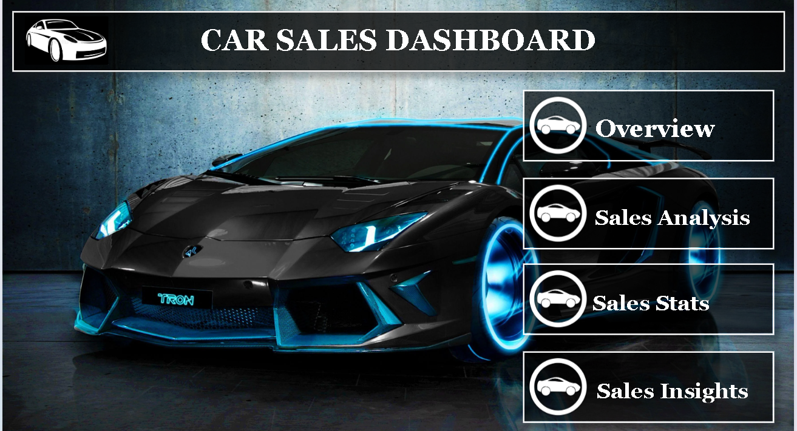
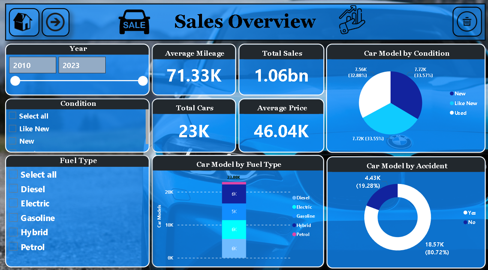
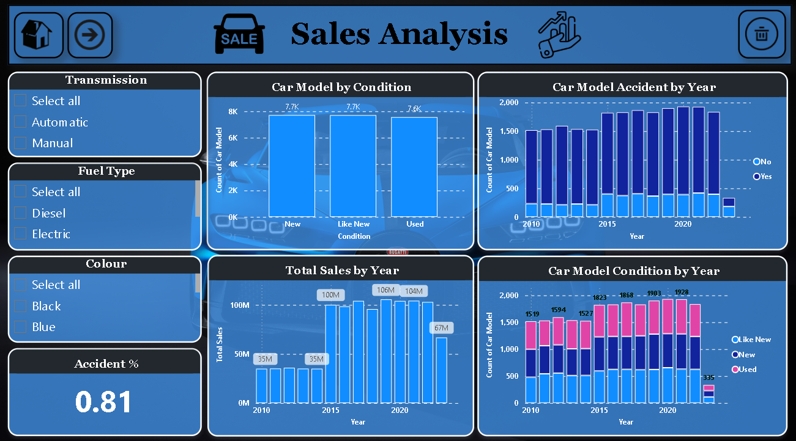
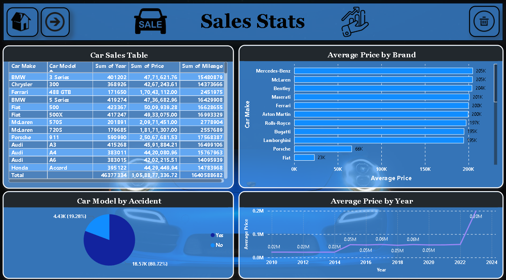
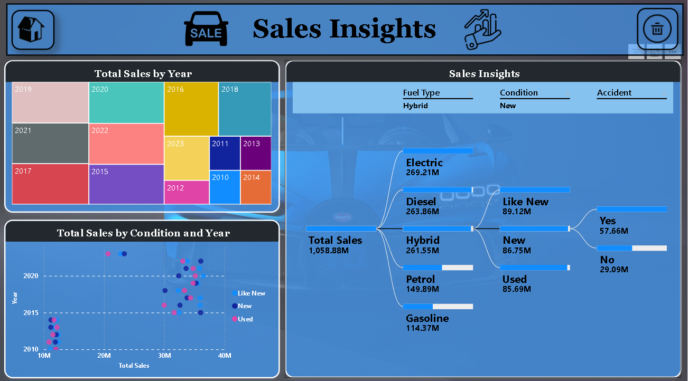

# 🚗 Car Sales Dashboard

This Power BI dashboard analyzes car sales data with insights into performance by brand, time, and region. It is structured across five interactive pages, each focusing on a specific aspect of the business.

---

## 📌 Dashboard Preview

| Page | Preview |
|------|---------|
| **1. Home**         |        |
| **2. Monthly Trends**   |    |
| **3. Sales by Region**  |            |
| **4. Brand Performance**|              |
| **5. Model Breakdown**  |              |

> 📝 Screenshots are located in the `screenshots/` folder.

---

## 📊 Key Insights

- Sales performance over time (monthly and yearly)
- Top-performing car brands and models
- Regional breakdown of car sales
- Comparison of different time periods
- Dynamic filtering with slicers

---

## 🛠️ Tools & Technologies

- Power BI Desktop  
- DAX for calculated measures  
- Power Query for data transformations  
- Slicers, cards, bar charts, and line graphs

---

## 🗂️ File Included

- `Car Sales.pbix` – Main dashboard file
- `/screenshots/` – Folder containing preview images

---

## 📥 How to Use

1. Clone or download the repository
2. Open `Car Sales.pbix` using **Power BI Desktop**
3. Navigate through each of the 5 report pages
4. Use slicers to filter by brand, year, or region

---

## 🙋‍♂️ Author

**Akash Kumar Singh**  
[GitHub Profile](https://github.com/akash4410singh)

---

## 📜 License

For learning and portfolio purposes. Contact me for business or custom versions.

